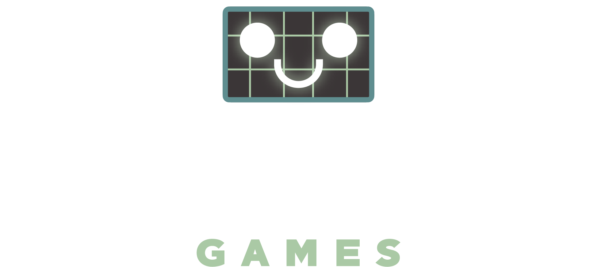

# Regression Games Capture the Flag - Getting Started 

Regression Games has announced our newest game mode and tournament, the Alpha Cup, which features a Capture the Flag game in Minecraft. In this tutorial, we will write a simple bot that reacts to events within the game to capture the flag and score it within your team’s base!

**This is our Typescript guide. Also see our JavaScript and Python guides!**

**Want to skip the guide and just use the templates? Find those here: Typescript | JavaScript | Python**

# Requirements to get started

* A GitHub account (you can create one [here](https://github.com))
* A Minecraft account (Java Edition) with `release 1.18.2` installed from the launcher (download launcher from [here](https://www.minecraft.net/en-us/download), and see [here](https://help.minecraft.net/hc/en-us/articles/360034754852-Change-Game-Version-for-Minecraft-Java-Edition) for changing your version)
* A Regression Games account - create one [here](https://play.regression.gg), and go through the setup flow to connect your GitHub account and Minecraft account.
* Your GitHub account must be connected to Replit - you can do that [here](https://replit.com/account#connected-services).

Let's get started! Click the right arrow below to go to the next page.

> For an example of a completed template see [final_code.js](#final_code.js)

> Run into an issue? Send a message in our [Discord](https://discord.gg/925SYVse2H)!