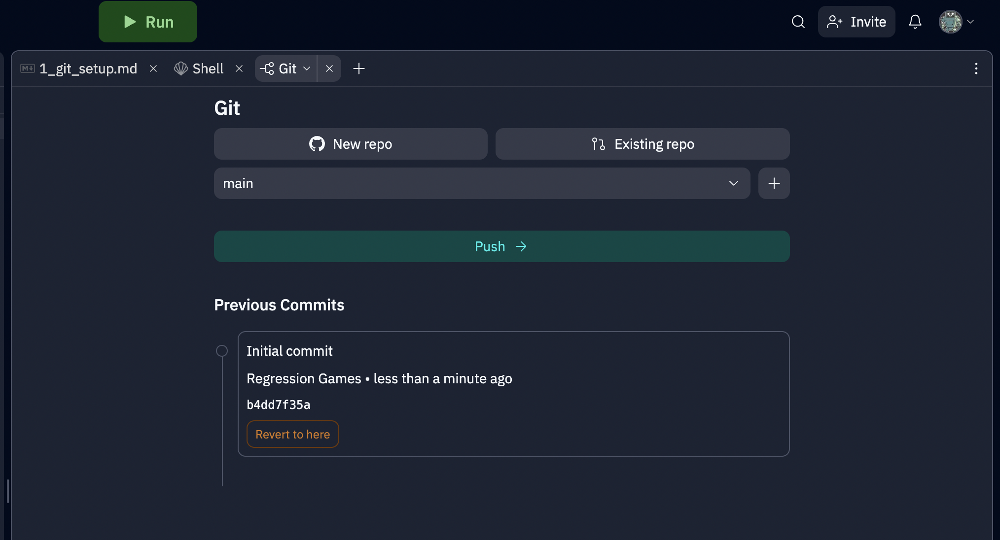
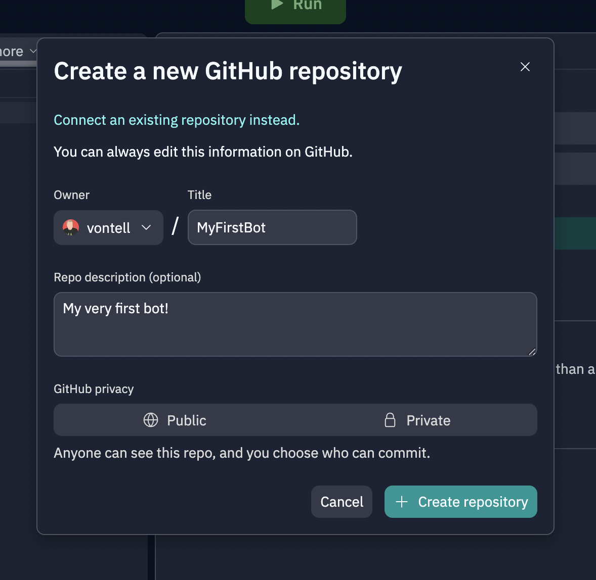

# Create a repo on GitHub

_Message on our [Discord](https://discord.com/invite/925SYVse2H) if you get stuck here!_

The first step to creating a bot on Regression Games is to
create a GitHub repository, which will hold your bot code. 
If you do not have a GitHub account, you can create one 
[here](https://github.com).

Open the "Git" tool on Replit from the tools section (or by clicking
`+` to open a new tab in the editor window and searching for "Git").


In the Git window that appears, click "+ Create a Git repo". Wait a few
seconds, as it sets everything up in your Repl. Eventually, you should
see a "New repo" button appear (or a button to connect your GitHub account
if you haven't yet - do that first). Click that button enter info about your
new bot (see example below), and then click
"+ Create repository". After a few seconds, your code will be pushed
to GitHub (or click the **Push** button yourself if it is present).
You can now visit your GitHub repository by clicking the
link at the top of the Git tool pane.




## Updating code

Whenever you need to update code for your bot, simply visit this
pane and click "Commit All & Push". Note that sometimes the Git 
pane **will not detect your changes automatically**. If this happens,
you can close the Git tab and re-open it using the steps above.

## Note on ease-of-use (optional)

For a more streamlined way to upload code for your bot you can also 
**configure the Run button to push to your GitHub repository)**. If you'd 
like to configure this approach, please do the following:

1. Create a new **empty** repo on [GitHub](https://github.com)
2. Open the **Secrets** tool on Replit (from the tool pane or by searching
   for "Secrets" in a new editor tab).
3. Click **Open Raw Editor**
4. Enter the following JSON (see below code block for more info on these values):

```
{
  "GITHUB_REPO": "The url of the HTTPS git link to your git repo",
  "GITHUB_EMAIL": "Your GitHub email address",
  "GITHUB_USERNAME": "Your GitHub username",
  "GITHUB_TOKEN": "A personal access token"
}
```

* `GITHUB_REPO` - The HTTPS link (_not_ the SSH link) to your GitHub repo. This repository **should be empty***. You can get the link by clicking the "< > Code" button on GitHub and copying the text from the HTTPS tab to your clipboard
* `GITHUB_EMAIL` - The email you use for your GitHub account, which can be found in your profile
* `GITHUB_USERNAME` - Your GitHub username
* `GITHUB_TOKEN` - A personal access token, generated from https://github.com/settings/tokens. Make sure to select all permissions for "repo".

Now, whenever you click **Run**, the code will automatically push to that repo with a default
message.

Our code is now ready on GitHub! Let's connect this code to our Regression Games
account!